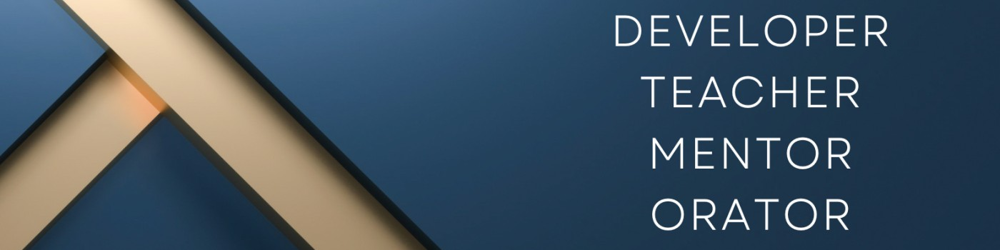
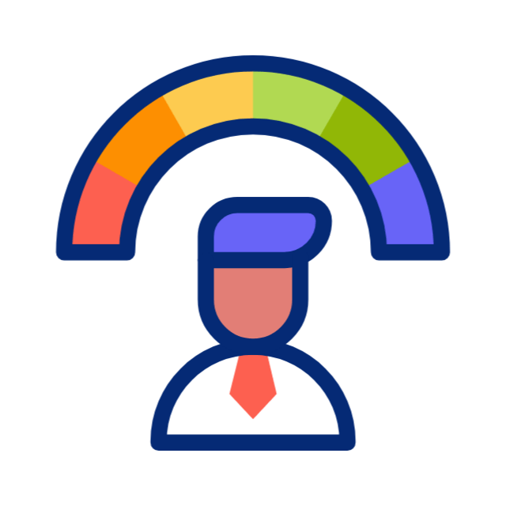

<h1 align="left"> Sayed Azhar Sabri</h1>

I’m a full-stack developer with 15+ years of experience in developing applications and following my passion of teaching for bridging tech & education.

 

## Rapid-fire

<table><tr><td valign="top" width="50%">

- 📫 How to reach me **sayedazharsabri@gmail.com**

- 🔭 I’m currently working on a TypeScript based NPM Package compatiable for CJS and ESM both.

- 🌱 I’m currently exploring Web3 - Blockchain and it's integration with Web2.

- ❓ Ask me about anything related to product architecture, web development, career in IT

</td><td valign="top" width="50%">

</td></tr></table>

 

# 🌐 Socials:
 
    

# Skills  :

             
  

# 📊 GitHub Stats:

 
 

## 🏆 GitHub Trophies

### 🔝 Top Contributed Repo

<b>Top Repositories</b>

    
